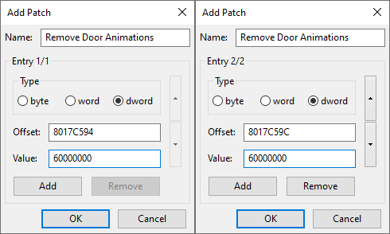

# GameCube

## Dolphin

1. Download the patch file for your release:
   - [[GCDJ08] [JP] Biohazard: Code: Veronica Kanzenban](Dolphin/GCDJ08.ini)
   - [[GCDE08] [US] Resident Evil: Code: Veronica X](Dolphin/GCDE08.ini)
   - [[GCDP08] [EU] Resident Evil: Code: Veronica X](Dolphin/GCDP08.ini)
2. Save the patch file to the ***GameSettings*** folder under Dolphins [User Directory](https://dolphin-emu.org/docs/guides/controlling-global-user-directory/):
   - Windows: ***Documents/Dolphin Emulator/GameSettings***
   - MacOS: ***~/.dolphin-emu/GameSettings***
   - Linux: ***~/.dolphin-emu/GameSettings***
3. Open Dolphin and run the game!

Adding patch manually (optional):

1. Open Dolphin then ***Right Click Game***, select ***Properties*** then select ***Patches*** tab.
2. Press the ***Add*** button (near bottom of the dialog) to open the ***Add Patch*** dialog.
3. In the ***Name*** field enter ***Remove Door Animations***.
4. Find the ***Offsets*** and ***Values*** for your game release from the tables below.

**[GCDJ08] [JP] Biohazard: Code: Veronica Kanzenban**

```
Offset   Value
8017C594 60000000
8017C59C 60000000
```

**[GCDE08] [US] Resident Evil: Code: Veronica X**

```
Offset   Value
80169FAC 60000000
80169FB4 60000000
```

**[GCDP08] [EU] Resident Evil: Code: Veronica X**

```
Offset   Value
8016A948 60000000
8016A950 60000000
```

5. Entry 1:
   - Select ***dword***.
   - Fill in ***Offset*** and ***Value***.
6. Press the ***Add*** button to create another entry.
7. Entry 2:
   - Select ***dword***.
   - Fill in ***Offset*** and ***Value***.
8. Press ***OK*** to save the patch then ***Close*** the properties dialog.
9. Run the game!

*Example screenshots showing patch offsets for JP CVX release:*



## Console

Codes for Gecko and Action Replay.

**[[GCDJ08] [JP] Biohazard: Code: Veronica Kanzenban](GameCube/GCDJ08.gct)**

```
Remove Door Animations
0417C594 60000000
0417C59C 60000000
```

**[[GCDE08] [US] Resident Evil: Code: Veronica X](GameCube/GCDE08.gct)**

```
Remove Door Animations
04169FAC 60000000
04169FB4 60000000
```

**[[GCDP08] [EU] Resident Evil: Code: Veronica X](GameCube/GCDP08.gct)**

```
Remove Door Animations
0416A948 60000000
0416A950 60000000
```