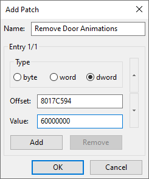

# Resident Evil: Code: Veronica Door Skip

This repository contains patches to remove door animations in Resident Evil/Biohazard: Code: Veronica for GameCube, PlayStation 2 and PlayStation 3 releases running on console or emulator.

# Installation

## PlayStation 3

### RPCS3

1. Download [imported_patch.yml](RPCS3/imported_patch.yml) and save it to ***RPCS3\patches\imported_patch.yml***.
2. Open RPCS3 then ***Right Click Game***, select ***Configure Game Patches*** and enable the patch.
3. Run the game!

### Console

Install [Artemis PS3](http://artemis.psdev.tk/) onto your PS3.

1. Run Artemis, select **Online DB** and choose your release from the list:

```
[JP] Biohazard Code Veronica X          NPJB00135    01.01
     ...
[EU] Resident Evil Code Veronica X      NPEB00553    01.00
[US] Resident Evil Code Veronica X      NPUB30467    01.00
```

2. Enable ***Remove Door Animations*** code.
3. Read the [Using Artemis](http://artemis.psdev.tk/INSTALLATION.html#using-artemis) guide for more info on running the game.

Installing codes onto a USB drive (optional):

1. On a USB drive create a folder called ***USERLIST***.
2. Download the patch file for your release and save it to ***USERLIST***:
   - [[NPJB00135] [JP] Biohazard: Code: Veronica Kanzenban](NetCheat/Biohazard%20Code%20Veronica%20X%20NPJB00135%2001.01.ncl)
   - [[NPUB30467] [US] Resident Evil: Code: Veronica X HD](NetCheat/Resident%20Evil%20Code%20Veronica%20X%20NPUB30467%2001.00.ncl)
   - [[NPEB00553] [EU] Resident Evil: Code: Veronica X](NetCheat/Resident%20Evil%20Code%20Veronica%20X%20NPEB00553%2001.00.ncl)
3. Insert the USB drive into your PS3 and run Artemis.
4. Select **Cheats** and choose your release from the list.

```
[JP] Biohazard Code Veronica X          NPJB00135    01.01
     ...
[EU] Resident Evil Code Veronica X      NPEB00553    01.00
[US] Resident Evil Code Veronica X      NPUB30467    01.00
```

5. Enable ***Remove Door Animations*** code.
6. Read the [Using Artemis](http://artemis.psdev.tk/INSTALLATION.html#using-artemis) guide for more info on running the game.

## PlayStation 2

### PCSX2

1. Download the patch file for your release and save it to ***PCSX2\cheats***:
   - [[SLPM-650.22] [JP] Biohazard: Code: Veronica Kanzenban](PCSX2/d0cf2395.pnach)
   - [[SLUS-201.84] [US] Resident Evil: Code: Veronica X](PCSX2/24036809.pnach)
   - [[SLES-503.06] [EU] Resident Evil: Code: Veronica X](PCSX2/6ea9dda9.pnach)
2. Open PCSX2, select ***System*** and check ***Enable Cheats***.
3. Run the game!

### Console

Codes for Action Replay/GameShark/CodeBreaker etc...

**[SLPM-650.22] [JP] Biohazard: Code: Veronica Kanzenban**

```
2013393C 00000000
20133944 00000000
```

**[SLUS-201.84] [US] Resident Evil: Code: Veronica X**

```
20133D4C 00000000
20133D54 00000000
```

**[SLES-503.06] [EU] Resident Evil: Code: Veronica X**

```
20133FCC 00000000
20133FD4 00000000
```

## GameCube

### Dolphin

1. Download the patch file for your release:
   - [[GCDJ08] [JP] Biohazard: Code: Veronica Kanzenban](Dolphin/GCDJ08.ini)
   - [[GCDE08] [US] Resident Evil: Code: Veronica X](Dolphin/GCDE08.ini)
   - [[GCDP08] [EU] Resident Evil: Code: Veronica X](Dolphin/GCDP08.ini)
2. Save the patch file to the ***GameSettings*** folder under Dolphins [User Directory](https://dolphin-emu.org/docs/guides/controlling-global-user-directory/):
   - Windows: ***Documents/Dolphin Emulator/GameSettings***
   - MacOS: ***~/.dolphin-emu/GameSettings***
   - Linux: ***~/.dolphin-emu/GameSettings***
3. Open Dolphin and run the game!

Adding patch manually (optional):

1. Open Dolphin then ***Right Click Game***, select ***Properties*** then select ***Patches*** tab.
2. Press the ***Add*** button (near bottom of the dialog) to open the ***Add Patch*** dialog.
3. In the ***Name*** field enter ***Remove Door Animations***.
4. Find the ***Offsets*** and ***Values*** for your game release from the tables below.

**[GCDJ08] [JP] Biohazard: Code: Veronica Kanzenban**

```
Offset   Value
8017C594 60000000
8017C59C 60000000
```

**[GCDE08] [US] Resident Evil: Code: Veronica X**

```
Offset   Value
80169FAC 60000000
80169FB4 60000000
```

**[GCDP08] [EU] Resident Evil: Code: Veronica X**

```
Offset   Value
8016A948 60000000
8016A950 60000000
```

5. Entry 1:
   - Select ***dword***.
   - Fill in ***Offset*** and ***Value***.
6. Press the ***Add*** button to create another entry.
7. Entry 2:
   - Select ***dword***.
   - Fill in ***Offset*** and ***Value***.
8. Press ***OK*** to save the patch then ***Close*** the properties dialog.
9. Run the game!

*Example screenshots showing patch offsets for JP CVX release:*




### Console

Codes for Gecko and Action Replay.

**[[GCDJ08] [JP] Biohazard: Code: Veronica Kanzenban](GameCube/GCDP08.gct)**

```
Remove Door Animations
0417C594 60000000
0417C59C 60000000
```

**[[GCDE08] [US] Resident Evil: Code: Veronica X](GameCube/GCDP08.gct)**

```
Remove Door Animations
04169FAC 60000000
04169FB4 60000000
```

**[[GCDP08] [EU] Resident Evil: Code: Veronica X](GameCube/GCDP08.gct)**

```
Remove Door Animations
0416A948 60000000
0416A950 60000000
```

# Acknowledgements

 - [nolberto82](https://gamehacking.org/vb/member/600-nolberto82) - [Skip Door Transition (SLUS-201.84)](https://gamehacking.org/vb/forum/video-game-hacking-and-development/hacker-threads/4554-nolberto82-codes/page264#post152904)
 - [RyTheHexer](https://gamehacking.org/vb/member/37426-rythehexer) - [Faster Area Transition (SLES-503.06)](https://gamehacking.org/vb/forum/video-game-hacking-and-development/hacker-threads/210219-rythehexer-s-ps2-mainly-pal-new-codes#post210387)
